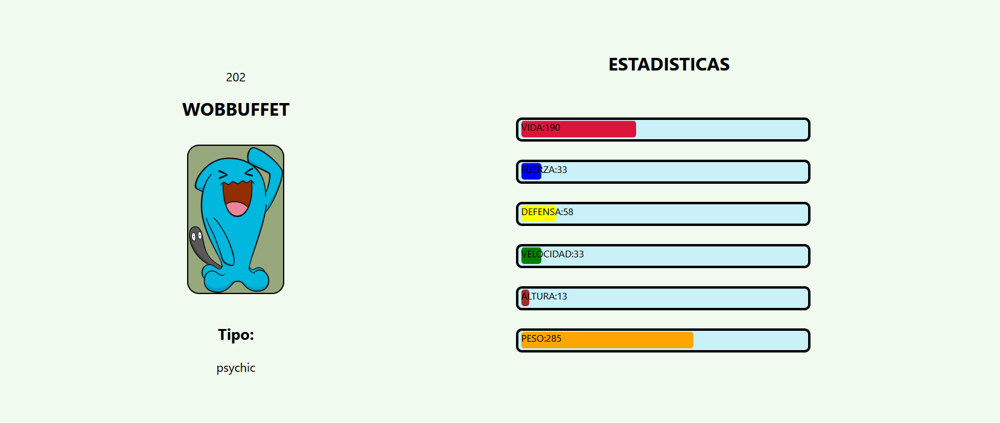

<h1 align="center">Hola mi nombre es Leonel 👋 </h1>
<h3 align="center">Un desarrollador al que le encanta aprender cosas nuevas. Tengo 30 años, soy Argentino y actualmente vivo en España, descubrí este fascinante mundo a finales del año 2020, siempre quise cambiar y trabajar en el mundo de las TI</h3>
 
<h2>Mi Proyecto</h2>
<h3>Pokemon</h3>

Aplicación de una sola página desarrollada que consume una API externa para traer pokemones aleatorios

<a href="https://pi-pokemon-psi.vercel.app/">Visita el sitio!</a>

 

 

<h3 align="left">Conecta conmigo: </h3>

 

<h3 align="left">Lenguajes y Herramientas:</h3 >

             

  

